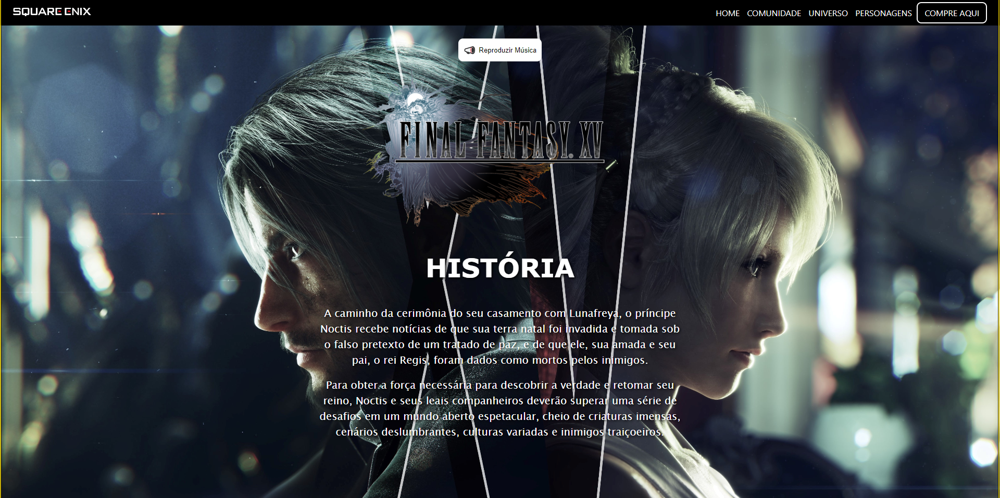

# Landing Page do Final Fantasy XV

Este é o repositório do projeto da Landing Page do jogo Final Fantasy XV. A página foi desenvolvida para oferecer uma experiência envolvente aos usuários, apresentando informações e elementos visuais relacionados ao jogo.

## Home da Página

## Conteúdo

O projeto contém os seguintes arquivos e diretórios principais:

- `index.html`: O arquivo HTML principal que estrutura a página.
- `Styles/`: Diretório contendo os arquivos CSS para estilização da página.
- `components/`: Diretório com os recursos adicionais, como imagens e áudio.

## Como utilizar

Para utilizar a Landing Page do Final Fantasy XV, siga as instruções abaixo:

1. Clone ou faça o download deste repositório para o seu ambiente local.
2. Abra o arquivo `index.html` em um navegador web compatível.
3. Explore a página e navegue pelos elementos interativos, como o menu de navegação e os conteúdos relacionados ao jogo.

## Contribuição

Contribuições são bem-vindas! Se você deseja contribuir para este projeto, siga as etapas abaixo:

1. Faça um fork deste repositório.
2. Crie uma branch com a sua feature ou correção: `git checkout -b minha-feature`.
3. Faça as alterações desejadas e faça commit das mesmas: `git commit -m 'Minha nova feature'`.
4. Envie as alterações para o repositório remoto: `git push origin minha-feature`.
5. Abra um pull request para que possamos revisar e incorporar as alterações.

## Contato

Se tiver alguma dúvida ou sugestão relacionada a este projeto, sinta-se à vontade para entrar em contato:

- Nome: Ademar Castro
- Email: ademar.castro.curriculo@gmail.com
- LinkedIn: [Ademar Castro](https://www.linkedin.com/in/ademar-castro-8bb95b256/)

---

